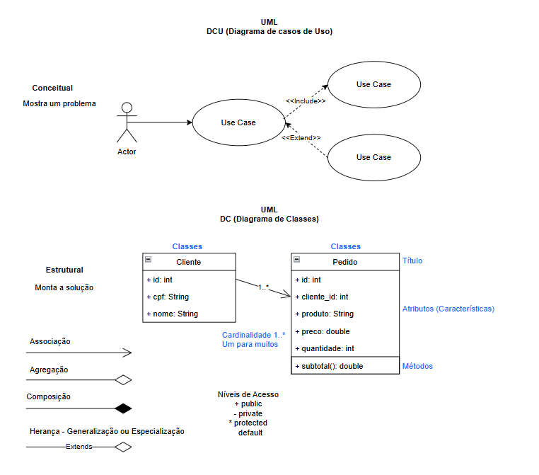
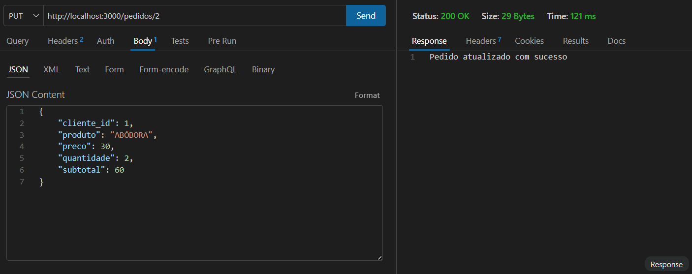
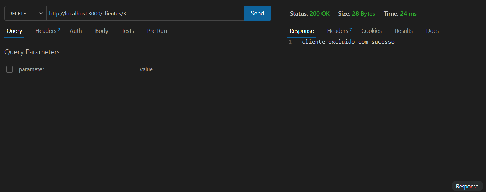

# Pedidos BackEnd MVC DC
Back-End com duas coleções mockup JSON, clientes e pedidos, CRUD, para aprender MVC e UML diagrama de classe
## Diagrama

## Post (Alterar)

## Delete (Excluir)

## Tecnologias
- Node.js
- VsCode (Thunder Client)
- Javascript
- MVC

## Passos para testar
- Clone este repositório e abra o VsCode
- Instale as dependências e execute com os seguintes comandos no terminal:
```bash
npm install
npm run dev
```